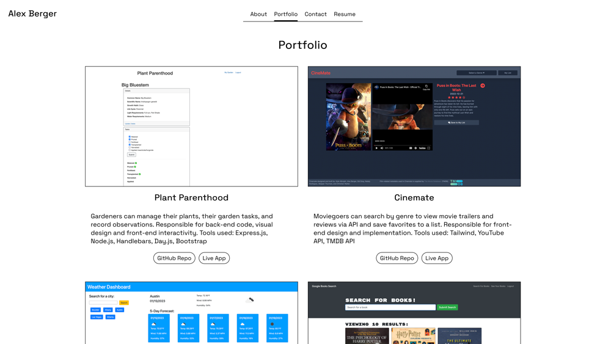

# React Portfolio

## Description
A single-page application built with React displaying my bio, resume and skills, and portfolio of projects.

## Deployed App
[Link](https://aberger3647.github.io/portfolio/)
  
## Table of Contents
- [Screenshot](#screenshot)
- [Usage](#usage)
- [License](#license)
- [Questions](#questions)
  
## Screenshot

  
## Usage
Click any of the links in the header and footer to navigate.

## License
Learn more about [MIT](https://choosealicense.com/licenses/mit/).
  
## Questions
GitHub Username: aberger3647

You can reach me with any questions at aberger3647@gmail.com
